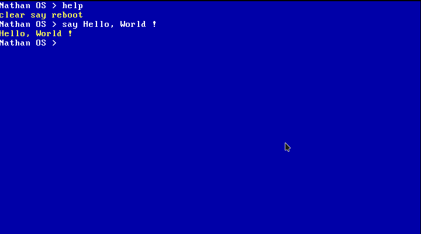
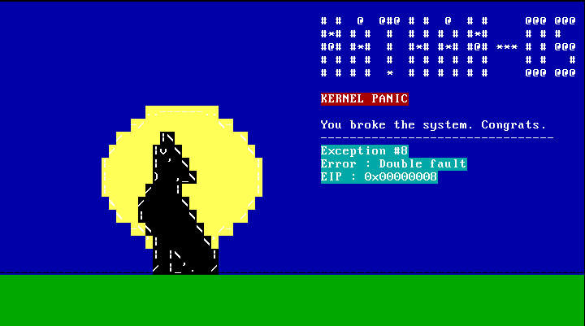
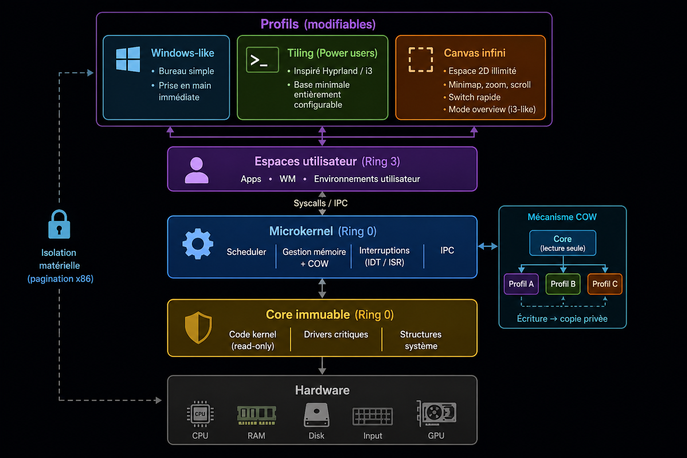

# Vault-OS

> OS 32 bits écrit de 0 en C et assembleur x86.
> _Tout casser sans jamais briser._

---

## C'est quoi Vault-OS ?

Vault-OS est un système d'exploitation 32 bits construit from scratch, sans libc externe, sans framework, sans raccourcis.

Son principe central : **un noyau immuable que rien ne peut corrompre, entouré d'environnements utilisateur que l'on peut casser librement.**

Peu importe ce qui se passe dans l'espace utilisateur - mauvaise config, driver planté, environnement graphique cassé - le Core reste intact et le système reste toujours récupérable.

---

## Screenshots

| Shell texte                | Kernel Panic                       |
| -------------------------- | ---------------------------------- |
|  |  |

---

## Architecture



### Core immuable

Le Core contient le code kernel, les drivers critiques et les structures système. Ses pages sont marquées `R/W=0, U/S=0` dans les tables de pagination x86 - aucune écriture n'est possible, même depuis ring 0. Le CPU le refuse au niveau matériel.

Concrètement : même un bug interne au kernel ne peut pas corrompre le Core.

### Microkernel

Tourne en ring 0, réduit au strict minimum :

- Gestion mémoire physique (PMM bitmap) et virtuelle (VMM, pagination x86)
- Scheduler round-robin avec context switch en assembleur
- IDT - 256 entrées, ISR stubs, gestion des exceptions CPU
- IPC entre les services userspace
- Drivers de base : clavier PS/2, VGA texte, port série COM1, souris PS/2

### Profils (Copy-On-Write)

Chaque profil est un espace d'adressage indépendant avec son propre `cr3`. Au démarrage d'un profil, ses pages pointent vers les mêmes frames physiques que le Core - aucune copie n'est faite. Si le profil tente d'écrire sur une de ces pages, le CPU déclenche une page fault. Le kernel alloue une nouvelle frame, y copie le contenu, redirige l'entrée de la table de pages. Le Core n'est jamais touché.

Résultat : isolation matérielle réelle entre profils, empreinte mémoire minimale, Core toujours intact.

### VFS

Arborescence unifiée montée au-dessus de plusieurs filesystems :

```
/              ← RamFS
├── dev/       ← DevFS (tty, com1, null, zero)
├── tmp/       ← RamFS
├── config/
│   └── profiles/
└── disk/      <- FAT32
```

---

## Environnements utilisateur

Vault-OS propose trois environnements, chacun tournant dans son propre profil COW isolé.

### Bureau Windows-like

Un bureau classique avec barre des tâches, icônes, fenêtres redimensionnables et menu contextuel. Conçu pour une prise en main immédiate sans configuration.

### Tiling WM

Inspiré de i3 et Hyprland. Les fenêtres se placent automatiquement selon un arbre de disposition. Entièrement pilotable au clavier, personalisable, raccourcis configurables, 9 workspaces, barre de statut.

### Canvas infini

Un espace de travail 2D navigable librement — 10 000 × 10 000 pixels virtuels. Les fenêtres se posent n'importe où, y compris hors écran. Navigation par scroll et raccourcis clavier, zoom, minimap, mode overview (Super+Tab).

---

## Fonctionnalités

### Bootloader (2 stages)

- Stage 1 - MBR 512 octets, signature `0xAA55`, chargement stage 2 via `int 0x13` CHS
- Stage 2 - ligne A20, lecture LBA étendue, parcours répertoire FAT32 (format 8.3), suivi chaîne de clusters, kernel chargé à `0x20000`, memory map E820 à `0x6000`, GDT 5 entrées, passage mode protégé, parsing ELF32, saut vers `e_entry`

### Kernel

- GDT rechargée depuis C, IDT 256 entrées, ISR stubs `isr0`–`isr31`
- IRQ0 (timer), IRQ1 (clavier) - cycle `pushad/iret` complet
- PIC 8259 - remappé, masqué, EOI
- PIT - 1000 Hz, canal 0 mode 3
- VGA texte 80×25 - scroll, curseur hardware, couleurs
- Port série COM1 - 38400 baud 8N1, sortie `printk`
- Kernel panic - sortie visuelle colorée

### Mémoire

- PMM - allocateur bitmap, `alloc_page` / `free_page`
- VMM - paging complet, tables de pages par profil, TLB invalidation
- COW - page fault handler ISR 14, copie privée à la demande
- Heap kernel - `kmalloc` / `kfree` / `krealloc`, coalescence

### Processus

- `process_t` - pid, état, `cr3`, pile kernel, point d'entrée
- Context switch en assembleur (registres callee-saved, swap `cr3`)
- Scheduler round-robin, processus idle avec `hlt`
- TSS - `esp0` mis à jour à chaque context switch
- `fork`, `exec`, `wait`, zombies nettoyés proprement
- Signaux - `SIGKILL`, `SIGSEGV`, `SIGTERM`, `SIGCHLD`
- Pipes - buffer 4096 octets, bloquants, hérités au `fork`

### Syscalls (`int 0x80`)

- `exit`, `read`, `write`, `open`, `close`, `getpid`, `fork`, `exec`
- Validation systématique des pointeurs reçus depuis ring 3
- Trap gate DPL=3 - accessible depuis ring 3 sans GPF

### Graphique

- Framebuffer VESA - détecté en stage 2, mappé via VMM
- Primitives - `put_pixel`, `fill_rect`, `draw_line` (Bresenham), `draw_circle` (Midpoint), `blit`, `blit_alpha`
- Rendu texte - police PSF 8×16
- Double buffering - rendu dans un back buffer, `flip()` vers le framebuffer
- Driver souris PS/2 - paquets 3 octets, IRQ12, delta X/Y, boutons
- Curseur souris - sprite 12×20, sauvegarde/restauration des pixels sous le curseur
- Window manager - décoration, drag, focus, z-order, boucle 60 Hz

### VFS

- Interface générique - `open`, `read`, `write`, `close`, `readdir`, `mkdir`, `unlink`
- RamFS - filesystem en mémoire, toutes opérations supportées
- DevFS - `/dev/tty`, `/dev/com1`, `/dev/null`, `/dev/zero`
- FAT32 - lecture BPB, suivi chaîne de clusters, `finddir`, `open`, `read`
- File descriptors par processus - `stdin`/`stdout`/`stderr` initialisés au boot

### Applications

- Terminal graphique - 80×25, scroll, shell complet branché dessus
- Gestionnaire de fichiers - navigation VFS, icônes, menu contextuel
- Quelques Applications
- Format d'installation personalsé (.napp)
- Convertisseur de .deb en .napp

### Libc (in-kernel)

- `string.h` - `strlen`, `strcpy`, `strcmp`, `strcat`, `strstr`, `strtok_r`...
- `memory.h` - `memcpy`, `memset`, `memcmp`, `memmove`
- `stdlib.h` - `atoi`, `itoa`, `strtol`, `malloc`/`free`, `realloc`
- `stdio.h` - `printf`, `sprintf`, `snprintf` (`%d %s %x %u %c %p`)

---

## Build & Run

### Dépendances

```bash
# Arch / CachyOS / Manjaro
yay -S i686-elf-gcc nasm qemu-system-x86 grub xorriso mtools
```

### Compiler et lancer

```bash
make clean && make img && make run-img
```

### Debug avec GDB

```bash
# Terminal 1
make debug

# Terminal 2
gdb -ex "target remote :1234" build/kernel.bin
```

---

## Toolchain

| Outil                | Rôle                        |
| -------------------- | --------------------------- |
| `i686-elf-gcc`       | Cross-compilateur C 32 bits |
| `nasm`               | Assembleur                  |
| `i686-elf-ld`        | Linker                      |
| `qemu-system-i386`   | Émulateur                   |
| `mkfs.fat` + `mcopy` | Création image FAT32        |
| `gdb`                | Débogage                    |

---

## État actuel

Le projet est en cours de développement. Voici ce qui est fonctionnel aujourd'hui :

**Bootloader**

- ✅ Stage 1 — MBR, signature `0xAA55`, chargement stage 2 via `int 0x13` CHS
- ✅ Stage 2 — A20, LBA étendu, FAT32, kernel chargé à `0x20000`, E820, GDT, mode protégé, ELF32, saut `e_entry`

**Kernel**

- ✅ GDT, IDT 256 entrées, ISR stubs `isr0`–`isr31`
- ✅ IRQ0 (timer), IRQ1 (clavier) — `pushad/iret`
- ✅ PIC 8259 remappé, PIT 1000 Hz
- ✅ VGA texte 80×25 — scroll, curseur hardware, couleurs
- ✅ Port série COM1 — 38400 baud 8N1
- ✅ Kernel panic visuel

**Mémoire**

- ✅ Memory map E820
- ✅ PMM — allocateur bitmap
- ✅ Paging basique — identity map 4 premiers Mo, activation `cr0`

**Entrées**

- ✅ Clavier PS/2 AZERTY — scancodes, shift, ring buffer

**Shell**

- ✅ `help`, `clear`, `say`, `reboot`, backspace, couleurs VGA

**Libc**

- ✅ `strcmp`, `strncmp`

---

## Ressources

- [OSDev Wiki](https://wiki.osdev.org)
- [Intel x86 Software Developer Manuals](https://www.intel.com/content/www/us/en/developer/articles/technical/intel-sdm.html)
