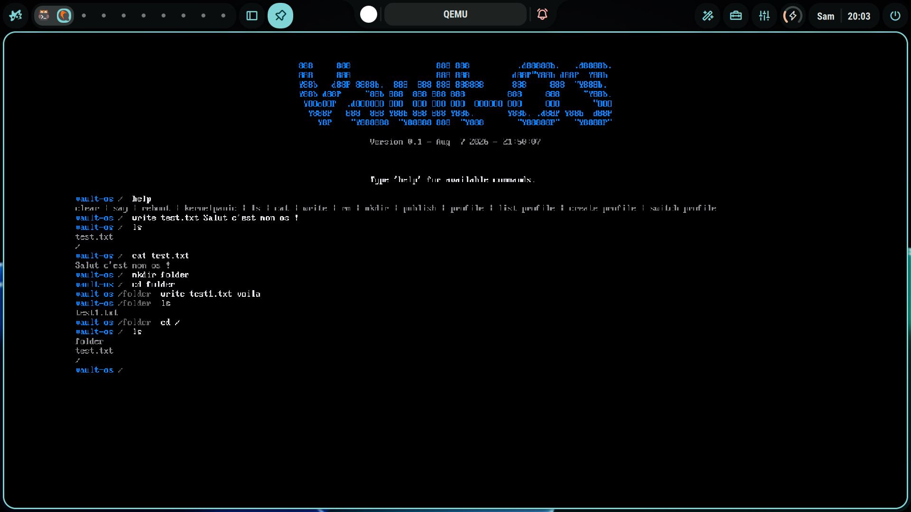
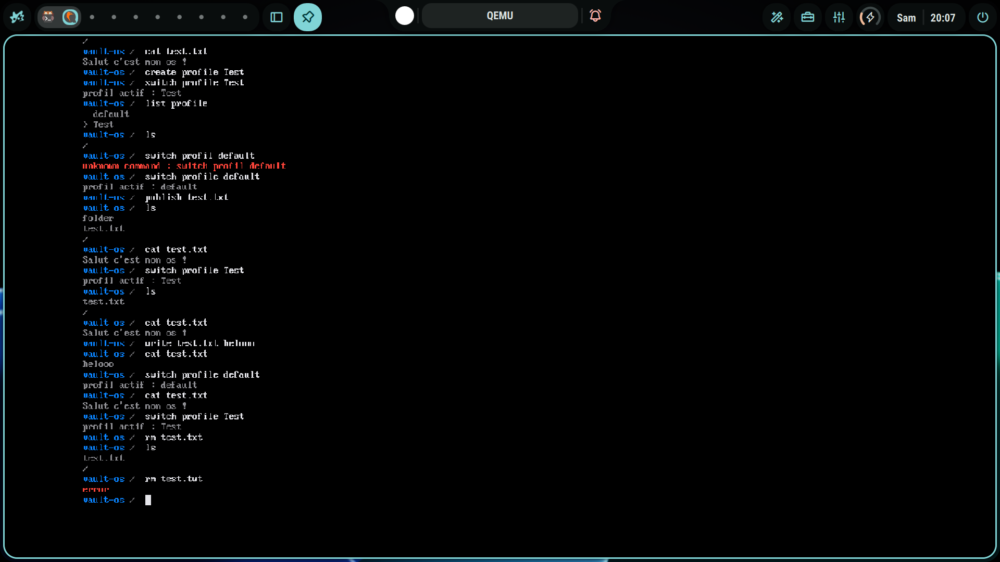
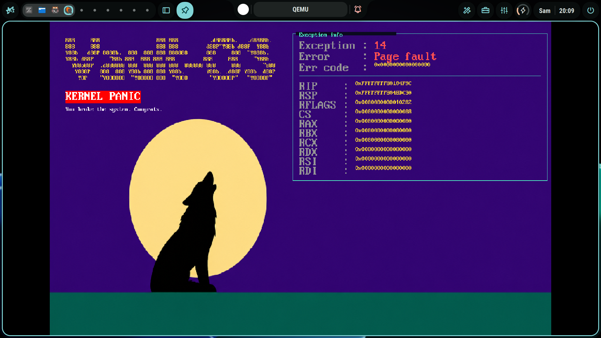
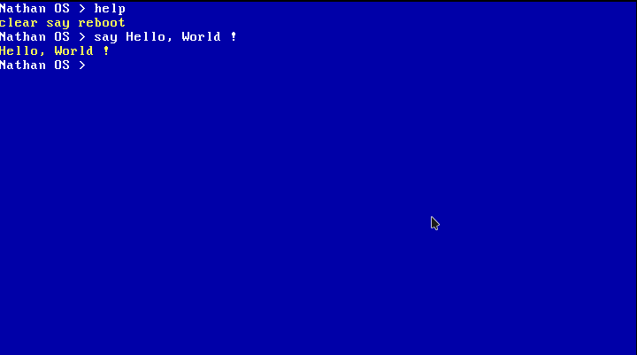
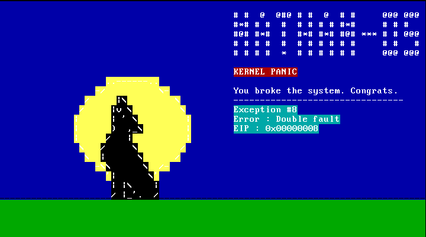

<p align="center">
  <pre align="center">
888     888                  888 888          .d88888b.   .d8888b. 
888     888                  888 888         d88P"Y88b d88P  Y88b 
Y88b   d88P 8888b.  888  888 888 888888      888     888  "Y888b. 
 Y88b d88P     "88b 888  888 888 888         888     888     "Y88b.
  Y88o88P  .d888888 888  888 888 888  888888 888     888       "888
   Y888P   888  888 Y88b 888 888 Y88b.       Y88b. .d88P Y88b  d88P
    Y8P    "Y888888  "Y88888 888  "Y888       "Y88888P"   "Y8888P" 
  </pre>
</p>

<p align="center">
  <strong>Système d'exploitation 64 bits écrit from scratch — Tout casser sans jamais briser.</strong>
</p>

<p align="center">
  
  
  
  
</p>

---

## Table des matières

- [Concept](#concept)
- [Screenshots](#screenshots)
- [Architecture](#architecture)
- [VaultFs](#vaultfs)
- [Commandes](#commandes)
- [Prérequis](#prérequis)
- [Build & Run](#build--run)
- [Structure du projet](#structure-du-projet)
- [État actuel](#état-actuel)
- [Ce qui est prévu](#ce-qui-est-prévu)
- [Ressources](#ressources)

---

## Screenshots

### Aujourd'hui
| VaultOs Shell & VaultFs | VaultOs Shell & VaultFs |
|:------------------------:|:------------------------:|
|  |  |
| *Shell interactif avec navigation VaultFs* | *Shell interactif avec navigation VaultFs* |

| Kernel Panic |
|:------------:|
|  |
| *Kernel panic handler* |

### Avant
| Shell (early) | Kernel Panic (early) |
|:-------------:|:--------------------:|
|  |  |
| *Premières versions du shell* | *Kernel panic handler* |

> ⚠️ Les screenshots sont pris sous QEMU et peuvent paraître moins nets qu'en conditions réelles — VaultOs tourne sur vrai hardware et le rendu y est nettement plus propre et plus fluide.

## Concept

VaultOs est un système d'exploitation 64 bits construit de zéro, sans libc externe, sans framework.

Son principe central : **un noyau immuable que rien ne peut corrompre, entouré d'environnements utilisateur que l'on peut casser librement.**

Peu importe ce qui se passe dans l'espace utilisateur — mauvaise config, driver planté, environnement graphique cassé — le Core reste intact et le système reste toujours récupérable.

> **Expérimente sans jamais casser ton OS.**

---

## Architecture

VaultOs adopte une architecture inspirée des noyaux monolithiques (Windows NT), avec une séparation stricte entre le Core immuable et les espaces utilisateur isolés par profil.

### Mémoire

| Composant | Rôle |
|-----------|------|
| **PMM** | Allocateur physique bitmap, bootstrap |
| **VMM** | Gestion de la mémoire virtuelle, pagination 64 bits |
| **Heap** | Allocateur kernel |

### Interruptions & CPU

| Composant | Rôle |
|-----------|------|
| **GDT** | Segments noyau / utilisateur |
| **IDT** | 256 entrées, ISR stubs, gestion des exceptions CPU |
| **TSS** | Switch de stack |
| **PIC** | Remappé, IRQs gérés proprement |

### Graphique

- Framebuffer via Limine
- Primitives de dessin (`fill_rect`, `draw_line`, `blit`)
- **SSAA** et **SDF** fonctionnels
- Chargeur de fond d'écran avec parsing PNG *(en cours)*

### Shell & TTY

- TTY fonctionnel avec couleurs
- Shell interactif intégré au noyau

---

## VaultFs

VaultFs est le système de fichiers conçu spécifiquement pour VaultOs. Aucun filesystem existant ne proposant d'isolation native par profil, il a été inventé from scratch pour incarner le principe central de l'OS.

### Modèle 3 couches

```
Layer 0 (Core)     ← Lecture seule, partagé entre tous les profils
Layer 1 (Shared)   ← Fichiers publiés par les profils, visibles de tous
Layer 2 (Private)  ← Espace privé par profil, modifiable librement
```

La résolution d'un chemin cherche d'abord dans le Layer 2 du profil courant, puis Layer 1, puis Layer 0. Un nœud marqué `VAULT_DELETED` dans le Layer 2 masque les couches inférieures (copy-on-write : le fichier d'origine n'est jamais touché).

Chaque profil possède son propre espace de fichiers. Pour rendre un fichier visible aux autres profils, il faut explicitement le **publier** vers la couche partagée. Si un autre profil modifie ce fichier, une copie privée est créée automatiquement — le fichier source reste intact. Seul le profil qui a créé un fichier peut le supprimer.

Concrètement : deux profils peuvent avoir des dotfiles complètement différents pour le même programme. C'est la différence fondamentale avec Linux.

### Sécurité by design

VaultFs offre une résistance structurelle aux logiciels malveillants :

- **Un virus infiltré dans un profil** ne trouve que des fichiers temporaires et volatiles — les données importantes sont dans la couche partagée, hors de sa portée directe.
- **Le seul vecteur d'attaque réel** est une écriture massive vers la couche partagée, le seul moment où les protections hardware sont relâchées.
- **Contre-mesure prévue** : un moniteur de taux d'écriture intégré au kernel, capable de détecter et bloquer ce comportement anormal en temps réel.

### Faille

Comme tout système d'exploitation, VaultOs n'est pas exempt de failles kernel. L'élévation de privilèges ou une corruption mémoire restent des vecteurs d'attaque théoriques — le modèle de sécurité de VaultFs réduit énormément la surface d'exposition, mais ne remplace pas la robustesse du noyau lui-même. Cepandant, je vous souhaite bon courage pour trouver une faille dans un noyau.

---

## Commandes

| Commande | Description |
|----------|-------------|
| `help` | Affiche la liste des commandes disponibles |
| `clear` | Efface le terminal |
| `reboot` | Redémarre le système |
| `kernelpanic` | Déclenche un kernel panic (test) |
| `say <texte>` | Affiche un message |
| `ls` | Liste les fichiers et dossiers du répertoire courant |
| `cat <fichier>` | Affiche le contenu d'un fichier |
| `write <nom> <contenu>` | Crée ou écrase un fichier avec le contenu donné |
| `mkdir <dossier>` | Crée un répertoire |
| `rm <fichier>` | Supprime un fichier |
| `cd <chemin>` | Change de répertoire |
| `publish <fichier>` | Publie un fichier vers la couche partagée (Layer 1) |
| `list profile` | Liste tous les profils existants |
| `create profile <nom>` | Crée un nouveau profil |
| `switch profile <nom>` | Bascule vers un autre profil |

---

## Prérequis

| Outil | Version minimale | Rôle |
|-------|-----------------|------|
| `x86_64-elf-gcc` | ≥ 12 | Cross-compilateur C 64 bits |
| `nasm` | ≥ 2.15 | Assembleur |
| `x86_64-elf-ld` | — | Linker |
| `qemu-system-x86_64` | ≥ 7 | Émulateur |
| `limine` | v7+ | Bootloader |

---

## Build & Run

```bash
# Cloner le dépôt
git clone https://github.com/nathanWorkout/Nathan-OS
cd Nathan-OS

# Compiler et lancer QEMU directement
make full

# Créer uniquement l'image (sans lancer QEMU)
make img
```

---

## Structure du projet

```
Nathan-OS/
├── boot/                        # Bootloader Limine
├── kernel/
│   ├── drivers/
│   │   ├── keyboard/            # Driver clavier PS/2
│   │   └── mouse/               # Driver souris PS/2
│   ├── Graphic/
│   │   └── gui/
│   │       └── wallpaper_loader/  # Chargeur PNG (en cours)
│   ├── idt/                     # Interruptions & exceptions
│   ├── io/                      # Ports E/S
│   ├── lib/                     # Libc interne (sqrt, string, memory)
│   ├── memory/                  # PMM, VMM, heap
│   ├── pic/                     # PIC
│   ├── pit/                     # Timer
│   ├── proc/                    # Processus & scheduler (en cours)
│   ├── serial/                  # Port série COM1
│   ├── shell/                   # Shell intégré
│   ├── tty/                     # Terminal virtuel
│   └── VaultFs/                 # Système de fichiers VaultFs
├── Images/                      # Captures d'écran
├── build/                       # Objets compilés (généré)
├── limine.conf
├── linker.ld
└── Makefile

### Ce qui est prévu

**Interface graphique — 3 modes**

- **Mode Windows-like** : un bureau clé en main avec beaucoup d'options de personnalisation, pour ceux qui veulent quelque chose de fonctionnel sans configuration.
- **Mode tiling** : inspiré de Hyprland, Niri ou i3. Tu pars d'une interface vide et tu construis ton environnement via des scripts — la philosophie des WM Linux. Des presets seront proposés.
- **Mode canvas infini** : inspiré de vxwm et Drift WM, un espace de travail 2D libre pour les esprits créatifs. Configurable via dotfiles, avec des presets disponibles.

**Compatibilité logicielle**

Un script de conversion `.deb` → `.napp` (Nathan Application) sera fourni. Presque toutes les applications Linux proposent un `.deb`, ce qui ouvre une compatibilité logicielle très large dès le départ.

**Sécurité**

Un antivirus intégré au kernel, surveillant le taux d'écriture dans la couche partagée de VaultFs pour détecter tout comportement anormal.
